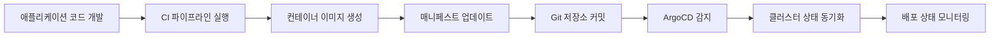

#argo #k8s 
## 1. GitOPS와 ArgoCD 개념 이해하기

### 1.1 GitOPS란 무엇인가?

GitOPS는 Git 저장소를 단일 진실 공급원(Single Source of Truth, SSOT)으로 활용하여 인프라와 애플리케이션 배포를 관리하는 운영 방식입니다. 이 개념은 Weaveworks[1](https://www.weave.works/technologies/gitops/)에서 처음 도입되었으며, 다음과 같은 원칙을 따릅니다:

1. **선언적(Declarative) 접근 방식**: 시스템의 원하는 상태(Desired State)를 명시적으로 정의
2. **버전 관리된 불변 상태**: Git을 통해 모든 변경 사항을 추적하고 관리
3. **자동화된 동기화**: 실제 상태(Actual State)와 원하는 상태 간의 차이를 자동으로 감지하고 조정
4. **지속적인 검증과 조정**: 지속적으로 시스템의 현재 상태를 모니터링하고 원하는 상태와 일치시킴

GitOPS는 다음과 같은 장점을 제공합니다:

- **투명성과 감사**: 모든 변경 사항이 Git에 기록되어 변경 이력 추적 용이
- **롤백 용이성**: Git 기록을 통해 이전 상태로 쉽게 롤백 가능
- **협업 향상**: Git의 PR/MR 프로세스를 통한 변경 사항 검토
- **자동화**: 수동 배포 과정 최소화 및 일관된 배포 프로세스
- **보안 강화**: Git의 접근 제어 메커니즘을 통한 변경 사항 관리

### 1.2 ArgoCD 소개

ArgoCD는 쿠버네티스를 위한 GitOPS 기반 지속적 배포(Continuous Delivery, CD) 도구입니다. Git 저장소에 정의된 애플리케이션의 원하는 상태를 쿠버네티스 클러스터에 자동으로 동기화하는 역할을 합니다.

ArgoCD의 주요 특징:

1. **쿠버네티스 네이티브**: 쿠버네티스 커스텀 리소스 정의(CRD)로 구현되어 쿠버네티스 API를 확장
2. **선언적 GitOPS**: Git 저장소를 단일 진실 공급원으로 사용
3. **다양한 배포 전략 지원**: Blue-Green, Canary, Rolling Update 등
4. **멀티 테넌트 및 RBAC**: 다중 사용자 환경 및 역할 기반 접근 제어
5. **Web UI 대시보드**: 애플리케이션 배포 상태 및 히스토리 시각화
6. **자동 동기화**: Git 저장소와 클러스터 간 상태 차이 감지 및 자동 조정

## 2. ArgoCD 아키텍처 및 구성 요소

ArgoCD는 다음과 같은 주요 구성 요소로 이루어져 있습니다:

1. **API Server**: RESTful API를 제공하는 gRPC/HTTP 서버. UI, CLI, CI/CD 시스템 등과 통신
2. **Repository Server**: Git 저장소를 로컬에 캐싱하고 애플리케이션 매니페스트를 생성
3. **Application Controller**: 배포된 애플리케이션 상태를 계속 모니터링하고 현재 상태와 원하는 상태를 비교
4. **Custom Resource Definitions(CRD)**:
    - **Application**: 배포할 애플리케이션 정의
    - **ApplicationSet**: 여러 애플리케이션을 템플릿화하여 관리
    - **AppProject**: 애플리케이션 그룹을 논리적으로 분리하고 권한 관리

## 3. GitOPS 레포지토리 구성 방법

효과적인 GitOPS 구현을 위한 레포지토리 구성 방법을 알아보겠습니다.

### 3.1 레포지토리 구성 패턴

1. **단일 레포지토리 패턴**: 모든 환경 및 애플리케이션 구성을 하나의 저장소로 관리
    
    ```
    /
    ├── apps/
    │   ├── app1/
    │   │   ├── base/
    │   │   ├── overlays/
    │   │   │   ├── dev/
    │   │   │   ├── staging/
    │   │   │   └── prod/
    │   ├── app2/
    │   │   ├── ...
    ├── infrastructure/
    │   ├── base/
    │   ├── overlays/
    │   │   ├── dev/
    │   │   ├── staging/
    │   │   └── prod/
    ```
    
2. **다중 레포지토리 패턴**: 애플리케이션과 환경을 분리하여 관리
    
    - **애플리케이션 레포지토리**: 애플리케이션 코드 및 배포 명세
    - **인프라 레포지토리**: 인프라 구성 및 환경별 설정
    - **배포 레포지토리**: 환경별 배포 정의 및 ArgoCD 애플리케이션 정의
3. **환경별 브랜치 전략**: 각 환경(dev, staging, production)을 별도의 브랜치로 관리
    
    ```
    main(개발) → staging → production
    ```
    

### 3.2 디렉토리 구조 예시

효과적인 GitOPS 저장소 구조 예시:

```
/
├── applications/             # ArgoCD Application 정의
│   ├── app-of-apps.yaml      # App of Apps 패턴 적용
│   ├── dev/
│   ├── staging/
│   └── prod/
├── manifests/                # 쿠버네티스 매니페스트
│   ├── base/                 # 기본 매니페스트
│   │   ├── deployment.yaml
│   │   ├── service.yaml
│   │   └── kustomization.yaml
│   └── overlays/             # 환경별 오버레이
│       ├── dev/
│       │   ├── kustomization.yaml
│       │   └── patch.yaml
│       ├── staging/
│       └── prod/
├── charts/                   # Helm 차트 (사용 시)
│   ├── app1/
│   └── app2/
└── config/                   # 설정 파일
    ├── dev/
    ├── staging/
    └── prod/
```

## 4. ArgoCD 설정 파일 작성하기

ArgoCD 배포를 위한 다양한 설정 파일 작성 방법을 알아보겠습니다.

### 4.1 Application 리소스

Application 리소스는 ArgoCD가 관리하는 가장 기본적인 단위로, 배포할 애플리케이션을 정의합니다.

**기본 Application 매니페스트 구조:**

```yaml
apiVersion: argoproj.io/v1alpha1
kind: Application
metadata:
  name: myapp                 # 애플리케이션 이름
  namespace: argocd           # ArgoCD가 설치된 네임스페이스
spec:
  project: default            # 프로젝트 이름 (RBAC 및 권한 관리)
  source:
    repoURL: https://github.com/organization/repo.git  # Git 저장소 URL
    targetRevision: HEAD      # 사용할 브랜치 또는 태그
    path: manifests/app       # 매니페스트 파일 경로
  destination:
    server: https://kubernetes.default.svc  # 대상 클러스터 API 서버
    namespace: myapp          # 배포될 네임스페이스
  syncPolicy:
    automated:                # 자동 동기화 설정
      prune: true             # 불필요한 리소스 제거
      selfHeal: true          # 수동 변경 시 자동 복구
    syncOptions:
      - CreateNamespace=true  # 네임스페이스 자동 생성
```

### 4.2 Helm 차트 사용 예시

ArgoCD에서 Helm 차트를 사용하는 방법:

```yaml
apiVersion: argoproj.io/v1alpha1
kind: Application
metadata:
  name: prometheus
  namespace: argocd
spec:
  project: default
  source:
    repoURL: https://prometheus-community.github.io/helm-charts
    chart: prometheus         # Helm 차트 이름
    targetRevision: 15.5.3    # 차트 버전
    helm:
      values: |               # values.yaml 파일 내용
        server:
          persistentVolume:
            enabled: false
        alertmanager:
          enabled: false
  destination:
    server: https://kubernetes.default.svc
    namespace: monitoring
```

**ArgoCD 2.6 이상에서 Multiple Sources 기능 사용 예시:**

```yaml
apiVersion: argoproj.io/v1alpha1
kind: Application
metadata:
  name: myapp
  namespace: argocd
spec:
  sources:
    - repoURL: 'https://charts.example.com'
      targetRevision: 1.0.0
      chart: app-chart
      helm:
        valueFiles:
          - $values/config/values.yaml
    - repoURL: 'https://github.com/organization/config.git'
      targetRevision: main
      ref: values
  destination:
    server: 'https://kubernetes.default.svc'
    namespace: myapp
```

### 4.3 Kustomize 사용 예시

Kustomize를 사용한 Application 정의:

```yaml
apiVersion: argoproj.io/v1alpha1
kind: Application
metadata:
  name: myapp-kustomize
  namespace: argocd
spec:
  project: default
  source:
    repoURL: https://github.com/organization/repo.git
    targetRevision: HEAD
    path: overlays/production
    kustomize:
      namePrefix: prod-      # 리소스 이름 접두사 추가
      images:                # 이미지 태그 오버라이드
        - name: myapp
          newTag: v1.0.0
  destination:
    server: https://kubernetes.default.svc
    namespace: production
```

ArgoCD에서 Kustomize build 옵션 설정 (ConfigMap):

```yaml
apiVersion: v1
kind: ConfigMap
metadata:
  name: argocd-cm
  namespace: argocd
data:
  kustomize.buildOptions: "--enable-helm --load-restrictor LoadRestrictionsNone"
```

### 4.4 ApplicationSet 사용 예시

ApplicationSet은 여러 환경이나 클러스터에 동일한 애플리케이션을 배포할 때 유용합니다.

**List Generator 예시:**

```yaml
apiVersion: argoproj.io/v1alpha1
kind: ApplicationSet
metadata:
  name: guestbook
  namespace: argocd
spec:
  generators:
  - list:
      elements:
      - cluster: dev
        url: https://kubernetes.dev.svc
      - cluster: staging
        url: https://kubernetes.staging.svc
      - cluster: production
        url: https://kubernetes.production.svc
  template:
    metadata:
      name: '{{cluster}}-guestbook'
    spec:
      project: default
      source:
        repoURL: https://github.com/organization/repo.git
        targetRevision: HEAD
        path: environments/{{cluster}}
      destination:
        server: '{{url}}'
        namespace: guestbook
```

**Cluster Generator 예시:**

```yaml
apiVersion: argoproj.io/v1alpha1
kind: ApplicationSet
metadata:
  name: my-app-cluster-generator
spec:
  generators:
  - clusters:
      selector:
        matchLabels:
          environment: production
  template:
    metadata:
      name: '{{name}}-my-app'
    spec:
      project: default
      source:
        repoURL: https://github.com/organization/repo.git
        targetRevision: HEAD
        path: apps/my-app
      destination:
        server: '{{server}}'
        namespace: my-app
```

## 5. ArgoCD 배포 프로세스 워크플로우

효과적인 GitOPS 구현을 위한 ArgoCD 배포 프로세스 워크플로우를 알아보겠습니다.

### 5.1 기본 워크플로우

1. **애플리케이션 코드 개발**: 개발자가 애플리케이션 코드 개발
2. **CI 파이프라인 실행**: 코드 변경 시 CI 파이프라인 실행 (테스트, 빌드, 이미지 생성)
3. **매니페스트 업데이트**: 새 이미지 태그로 매니페스트 파일 업데이트
4. **Git 저장소 커밋**: 변경된 매니페스트를 Git 저장소에 커밋
5. **ArgoCD 동기화**: ArgoCD가 Git 저장소 변경 감지 및 클러스터 상태 동기화
6. **배포 상태 모니터링**: ArgoCD UI에서 배포 상태 모니터링



### 5.2 Pull 요청(PR) 기반 워크플로우

1. **개발자가 변경 사항을 브랜치에 커밋**
2. **Pull 요청 생성**: 변경 사항에 대한 PR 생성
3. **자동화된 검증**: CI 시스템이 PR에 대한 검증 수행
4. **코드 리뷰**: 팀원들이 변경 사항 검토
5. **PR 승인 및 병합**: 검토 후 변경 사항 승인 및 병합
6. **ArgoCD 동기화**: 병합된 변경 사항 감지 및 동기화

### 5.3 GitOPS 전략 패턴

1. **환경별 단계적 배포**: 개발 → 스테이징 → 프로덕션 순서로 배포
2. **자동화 수준 분리**: 개발 환경은 완전 자동화, 프로덕션은 수동 승인 후 동기화
3. **Blue-Green 배포**: 두 버전의 애플리케이션을 병렬로 유지하며 트래픽 전환
4. **Canary 배포**: 일부 트래픽만 새 버전으로 전달하여 점진적 롤아웃

## 6. App of Apps 패턴

App of Apps 패턴은 여러 ArgoCD Application을 선언적으로 관리하는 방법입니다.

### 6.1 App of Apps 패턴 개념

하나의 상위 Application이 여러 하위 Application을 정의하는 구조입니다.

```
root-app (관리 Application)
├── app1
├── app2
└── app3
```

### 6.2 App of Apps 패턴 구현 예시

**1. 루트 애플리케이션 정의:**

```yaml
apiVersion: argoproj.io/v1alpha1
kind: Application
metadata:
  name: root-app
  namespace: argocd
spec:
  project: default
  source:
    repoURL: https://github.com/organization/repo.git
    targetRevision: HEAD
    path: apps
  destination:
    server: https://kubernetes.default.svc
    namespace: argocd
  syncPolicy:
    automated:
      prune: true
      selfHeal: true
```

**2. 하위 애플리케이션 정의 (apps/guestbook.yaml):**

```yaml
apiVersion: argoproj.io/v1alpha1
kind: Application
metadata:
  name: guestbook
  namespace: argocd
spec:
  project: default
  source:
    repoURL: https://github.com/organization/repo.git
    targetRevision: HEAD
    path: guestbook
  destination:
    server: https://kubernetes.default.svc
    namespace: guestbook
```

## 7. 실제 구현 예시

### 7.1 간단한 애플리케이션 배포 예시

**1. Git 저장소 구조:**

```
/
├── apps/
│   ├── nginx/
│   │   ├── deployment.yaml
│   │   ├── service.yaml
│   │   └── ingress.yaml
│   └── kustomization.yaml
```

**2. 배포 매니페스트 (apps/nginx/deployment.yaml):**

```yaml
apiVersion: apps/v1
kind: Deployment
metadata:
  name: nginx-deployment
spec:
  replicas: 2
  selector:
    matchLabels:
      app: nginx
  template:
    metadata:
      labels:
        app: nginx
    spec:
      containers:
      - name: nginx
        image: nginx:1.21
        ports:
        - containerPort: 80
```

**3. ArgoCD Application 정의:**

```yaml
apiVersion: argoproj.io/v1alpha1
kind: Application
metadata:
  name: nginx-app
  namespace: argocd
spec:
  project: default
  source:
    repoURL: https://github.com/your-org/your-repo.git
    targetRevision: HEAD
    path: apps/nginx
  destination:
    server: https://kubernetes.default.svc
    namespace: default
  syncPolicy:
    automated:
      prune: true
      selfHeal: true
```

### 7.2 Helm 차트 배포 예시

**1. ArgoCD Application 정의 (Helm 차트):**

```yaml
apiVersion: argoproj.io/v1alpha1
kind: Application
metadata:
  name: wordpress
  namespace: argocd
spec:
  project: default
  source:
    repoURL: https://charts.bitnami.com/bitnami
    chart: wordpress
    targetRevision: 14.0.4
    helm:
      values: |
        replicaCount: 2
        persistence:
          enabled: true
          size: 10Gi
        mariadb:
          auth:
            rootPassword: "password"
            database: "wordpress"
            username: "wordpress"
            password: "wordpress"
  destination:
    server: https://kubernetes.default.svc
    namespace: wordpress
  syncPolicy:
    automated:
      prune: true
      selfHeal: true
    syncOptions:
    - CreateNamespace=true
```

### 7.3 Kustomize 멀티 환경 배포 예시

**1. 디렉토리 구조:**

```
/
├── base/
│   ├── deployment.yaml
│   ├── service.yaml
│   └── kustomization.yaml
└── overlays/
    ├── dev/
    │   ├── kustomization.yaml
    │   └── patch.yaml
    ├── staging/
    │   ├── kustomization.yaml
    │   └── patch.yaml
    └── prod/
        ├── kustomization.yaml
        └── patch.yaml
```

**2. 기본 kustomization.yaml (base/kustomization.yaml):**

```yaml
apiVersion: kustomize.config.k8s.io/v1beta1
kind: Kustomization
resources:
- deployment.yaml
- service.yaml
```

**3. 개발 환경 오버레이 (overlays/dev/kustomization.yaml):**

```yaml
apiVersion: kustomize.config.k8s.io/v1beta1
kind: Kustomization
resources:
- ../../base
namePrefix: dev-
namespace: dev
patchesStrategicMerge:
- patch.yaml
images:
- name: my-app
  newName: registry.example.com/my-app
  newTag: dev
```

**4. 개발 환경 패치 (overlays/dev/patch.yaml):**

```yaml
apiVersion: apps/v1
kind: Deployment
metadata:
  name: my-app
spec:
  replicas: 1
```

**5. ArgoCD Application 정의:**

```yaml
apiVersion: argoproj.io/v1alpha1
kind: Application
metadata:
  name: my-app-dev
  namespace: argocd
spec:
  project: default
  source:
    repoURL: https://github.com/organization/repo.git
    targetRevision: HEAD
    path: overlays/dev
  destination:
    server: https://kubernetes.default.svc
    namespace: dev
  syncPolicy:
    automated:
      prune: true
      selfHeal: true
    syncOptions:
    - CreateNamespace=true
```

## 8. 결론 및 모범 사례

### 8.1 GitOPS 모범 사례

1. **환경별 구성 분리**: 개발, 스테이징, 프로덕션 환경별 구성 분리
2. **자동화 정도 조절**: 중요도에 따라 자동화 수준 조절 (프로덕션은 수동 승인 권장)
3. **매니페스트 검증**: PR 병합 전 매니페스트 검증 (linting, 보안 스캔)
4. **비밀 관리**: Vault, Sealed Secrets 등 안전한 비밀 관리 도구 사용
5. **모니터링 및 알림**: 배포 상태 모니터링 및 동기화 실패 시 알림 설정
6. **롤백 전략**: 문제 발생 시 신속한 롤백 프로세스 정의
7. **권한 관리**: 최소 권한 원칙 적용 및 환경별 접근 제어

### 8.2 ArgoCD 최적화 팁

1. **리소스 관리 최적화**: 대규모 클러스터에서는 Application 컨트롤러 성능 조정
2. **Health 상태 확인 커스터마이징**: 각 리소스 유형별 상태 확인 로직 사용자 정의
3. **정규 표현식 셀렉터 활용**: 대규모 프로젝트에서 효율적인 리소스 관리
4. **롤아웃 전략 사용자 정의**: 블루-그린, 카나리 등 고급 배포 전략 구현
5. **장애 복구 계획**: ArgoCD 장애 시 클러스터 상태 복구 계획 수립

### 8.3 실제 사용 시나리오 요약

1. **마이크로서비스 아키텍처**: 여러 마이크로서비스 배포 및 관리
2. **멀티 클러스터 환경**: 여러 클러스터에 동일한 애플리케이션 배포
3. **CI/CD 통합**: Jenkins, GitHub Actions 등과 통합하여 완전한 CI/CD 파이프라인 구축
4. **인프라 자동화**: 인프라 구성 요소(모니터링, 로깅 등) 자동 배포 및 관리
5. **멀티 테넌트 환경**: 여러 팀이 사용하는 공유 클러스터 관리

## 참고 자료

- ArgoCD 공식 문서[2](https://argo-cd.readthedocs.io/en/stable/)
- Weaveworks GitOPS 안내서[1](https://www.weave.works/technologies/gitops/)
- 쿠버네티스 공식 문서[3](https://kubernetes.io/docs/)
- CoffeeWhale - GitOps와 ArgoCD[4](https://coffeewhale.com/kubernetes/gitops/argocd/2020/02/10/gitops-argocd/)
- Jennifer Soft - Argo-CD를 이용한 GitOps 시스템 구축[5](https://jennifersoft.com/ko/blog/kubernetes/2023-08-30-jennifer-kubernetes-3/)

이상으로 ArgoCD와 GitOPS에 대한 개념, 설정 파일 작성 방법, 워크플로우 및 실제 구현 예시에 대한 종합 가이드를 마치겠습니다. 이 가이드가 GitOPS 방식으로 쿠버네티스 애플리케이션을 배포하고 관리하는 데 도움이 되길 바랍니다.

---

## Appendix: Supplementary Video Resources

![youtube](data:image/png;base64,iVBORw0KGgoAAAANSUhEUgAAALQAAACACAYAAACiJkOJAAAACXBIWXMAACxLAAAsSwGlPZapAAAAAXNSR0IArs4c6QAAAARnQU1BAACxjwv8YQUAAAupSURBVHgB7Z0LjFXVFYb/A8NjgBFEsSrFlCqk9dHWamtoom2qra80amObahuN2kat8ZEmGmON1aio1aoYa4xaX9VSCcXIy4gWi4I2JRhMgKhAClgsL4WZAYbHDNf1n73P9czl3pk7M/dxNvN/yc953OMV5v6z7jprr71PhADJAcNs0+Q13NRoGuq3janjoSWOG0yDvRr8eW4HmYb47SB/Hn6/we8n55Lrk9cHFvmr8tqo4Nw+0+4i1+41dbh/Hvb46/b5ffhth9de/x7t/nx6f49/Pdm2mXZ5tXVxnOy3mrabWqIv/t/BEKEO5NyHP9I02nRQSqP8+ZH+uCn1WlNKNMoAOFMN9PuFKjxfl39rhuAvSvJL0pHaT5/jNXv9lr8gNHiLqRnO5K3+uCV1fqs/35w6v8W0I3LvU1Oq8iHn3PvSnDTsIaYvmb5q+rLpCNPhcKZNzMkoy6jL6DgQIiRo/B1w5t/p92l+GvwT0wbTOtMa02Y4w2+K3LbiVMTQORcBaVya9dumb5mONY2DM/MoKEL2d/gtsA3O3GtNy0xLTUtMm0w7KxHR+2wy+xuMtc3PTBeavgOXlwpRLozU/zL93TQrctG91/TK0D6lOM50helquFRBiL7ClGSy6W+Ri9o9pseGNjOPgDPxtXA5sVIJUUmYkzMVucM0P3J5edn0yIxm5om2+aPpbCi1ENWFqcjzptsiV0kpi7INbWY+3jYzTV+BorKoDSwlvm66KHI3lN0yoLsLmC+bfmy780zjITOL2sES7lmm182DE8r5D7o1tPET0xS4kpwQ9eAk02Nm6qO6u7DLaJtzgyHT/BsKUU9Yx55u+k1XgzIlI7SvZvwBbqBEiHpDr/7UdG2ui9HkrlIODpb8AsqZRXZg787vTCeUuqCoWXNuuPojuKYgIbLGItMPIlez7kSpCH0dZGaRXb4HV/3Yj/0MnXP9wpdDiOzCzOK3uSIZRrEI/Su49k4hssyP4Ab5OtHJ0DnXl3wxhMg+vEG8Olfg4cIIzcGTb0KIMDgVbqJInkJDTzIdDCHC4OtwE0vy5A3tQ/cPIUQ4MDp3yijSEZr58/EQIixOTx+kDX0kVN0Q4XFSLjVjKm1ojg4eCiHCYoxXTNrQ7HUeCiHCgkG4qKEnQojw4Nou+V79tKGPgRBhkvdubGjfv3EkhAiT8clOEqEPQ0GBWoiAGJ80KiWGZg4yAkKECSt0XBsxb2hG55EQIkx4YxiXnNMRuglChAmDcTwomDa05g6KUOHsqripLjG0RghFyHBAsJOhx0CIcOE6izJ0t4wc6SRCoNNNoQxdjIkTgbfeAq67zr7U1OaScVi6wwDfeqdZKqUYOxZ4+GHgtdeAM84ABg2CyCRxUB7gd/QpdUVkBaDTTgOmTweefNKZPFJRKGPkUw4OqjRAdA/z6UsvBRYvVhqSPfKG5l2PInRPOOIIl4YsWQJceKH9FMtZlVhUmSYu4shPgkVpPRuwNxx7LPDcc8CMGcCkSfY9py+6OsKg3JQYWhG6twwbBpx3HvDii8DNNwNHH638uj7E2UZiaH0CfWX8eOCOO4CXXwYuucR+qlrrssbw6/Eg5dCVhLn0CScATz3lUpHjjlN+XTvyhmYo0U+9kjCXPv984L33gPvvd2U+UW1o6FGJoUU1GDwYuOEG4M03gcsus8KSesCqCAsb8U1hI0T1YMoxYQLw2GPACy8Ap56qakh1iL3MP4ZBVB8Owpx5phtCf/RRRevKwwg9XIauNY32hXjllcDSpcBNNwGjR0NUBBp6mAxdL3ijeM89wNy5wAUXKA3pO/mUQzl0vWB+fcoprsz3+ONutFHdfH1BOXQmYNpxxRXASy8B118PHH64Rht7R5xyqGUsK4wb5+rWs2YB55wjU/ecoTT0YIhscfLJwCuvOGOfeKJGG8tnsAydVQbaTfu557oy3y23uOitiN0dQ2TorDNmDHD77cCrr7o8u0nrAXWBInQQMFqz0YmjjdOmuT5sRetixIZWnSgUWNI76yzX9MQy3zFa0ruA2NCarRIaQ4YAl18OzJ/v5jYerEn7ngEydKhwZJE3ihxtZBrCMp8m7Q6UoUOHU8C4XggHZR54oL9PAWugoVXkPBAYMQK45hpg4ULgqquA4cPRD4lTDt0uH0gcdpirX/fPG8aILV77oLTjwGDZMuCRR9wI48aN6Ifso6E7IEOHzWefAc8+6xa/+fhj9GM6EkOLENm2zeXMNDJLeLkc+jkydLCsXOk6855/Hti9GyImNnQ7RDh8+ikwZYqLyq2tEJ1op6H3QGSfHTtcSylXZ1q1ym5/9kHsx24ZOuu02xfo++8D997rqhdKL7pijwydZbZvd62jrGAw1RDdIUNnEkbhp58G7rsPWLsWomxiQ+s7LCswvXjjDeChh4BFi1zeLHpCnEO3QdSfFSuAJ55wy4UpvegtbTT0Toj6wEoFS29TpwIPPgisXq3qRd/YqQhdLziqx2cgsnoxb55G+foOf4CK0HWBdWTO5GZdeY/uySsER7x3ytC1ZOtWV4K76y7XUCQqCXM1GbomtLQA774L3HgjsHy58uTqwB9qnHKoIaCafPghcNttwOzZFjoUO6oIe5JaaWgLH7G7NRWrkmzZ4gZGuLIo2zxFtaGhmxNDM6GWoSsBc+OZM93gCNOLDnXn1ggauoWGbvYHWnCmL9C4zJPZ2jlnjmVzqobWGGYZLemUQ/QG1o/Xr3fLdD3zDLBhA0RdyEfoFqjJv3fs3etG+bjYywcfQNSVfA7NlGMvRPmw7LZgATB5smsmElmgLQJ20dBW7Zehy4ajfHfe6Ub5mpshMgN9HD9OdjOUcnQN82SO8nENOUbl/r1UQFahj9FgYbrVPi413paCZuZi43ff7aoYaiLKKlv4R/JwvE2mr0F0ZpP9WC66CHj7bc3lyz7xUlGJoTdD7M+6dZoCFQ6xh5PRwS0Q+6P0IhQ4HBt7ODG0IrQIGXZ9xQ0ziaE3QYhwYZ9BJ0Ovh6ZiiXChmeOgnM6ht0OIMKGhO+XQnDevYS8RKvRuPKctMfQncE1KQoTIush3jCaGZsj+P4QIk/8mO7GhI7emwSoIESZ57w4odlKIgNhl+l9ykDY0O9Q1c0WExmakBgbThmYOrenJIjRKGpqFad0YitBYjVQgThuahWnl0SI03vFFjZi8of3Jf0KIcGCX3YL0icLFZfjiLggRBswo1qdPFBqak+VWQogwWAw/5J1QaGgm17MhRBj8JSqY4B0VXmGJ9HjbrDANhRDZhR79RlTwaO/9FmiM3Li4orTIOk9FRZ5THxW70qL0d23z71KvC1FnOGYyMSrS8lx0CV278D+2+TM0FC6yB6twN0Ql+ve7WhP6T6blECI7cKxkqmlmqQtKGtp+A9bY5vfQBFqRHZaa7o66WOmru1X755juhWaziPqzxjQ5cr0bJenS0H5ay+Nw6YfyaVEvmC/faJrR3YVlVTFybsmwX5ummAZDiNrB+a6/NC1INyGVoqwHBfnRmCdNV0ND46I2MCNYYjobZZqZ9LjObO86yTa3mM6BnpwlqgMXL/+H6dbIrypaLr0aODFTN9rm56Y7TeMgROV4x3SraZGZs8cPQu/TSKAZewicsS82nQ49Gk70Dpbh2G7xV9PcctOLYvR5aDvn3mOU6RjT900nmY42TTQdBA2fi87QrGz5/MhroWmRaX1UgfJwxc2Wc116Y0xjTUfBpSTs4JtgGm0abmoyjfBqgDiQiJ+57cXIS5MyJ2b9mI1v6/w+H+i4sViDUV+oWfTMuRtIRvKDTYd4HZo65v5oL15H0zNXZxoz0KuhYJtI3wKVgZUFGqzdbztSx+3+dT4xjUZt9uK6iIy4W/z+Vn/Mfc7G3ho5c9eETBvB17+ZtjT57Qi/Hen3eZ4RfxjcN8PQ1H5jatuYep37fF/m/4NS+6FXbGg83kTxYTDtfp/mYzNPm9/u9NvkXFvqteR1rkJLA7bgi0jbnDrfGmV4kO1zRnLXUZ0lWZIAAAAASUVORK5CYII=)

[ArgoCD] DevOps 엔지너어라면 알아야 할 GitOps!

Jul 19, 2023

![youtube](data:image/png;base64,iVBORw0KGgoAAAANSUhEUgAAALQAAACACAYAAACiJkOJAAAACXBIWXMAACxLAAAsSwGlPZapAAAAAXNSR0IArs4c6QAAAARnQU1BAACxjwv8YQUAAAupSURBVHgB7Z0LjFXVFYb/A8NjgBFEsSrFlCqk9dHWamtoom2qra80amObahuN2kat8ZEmGmON1aio1aoYa4xaX9VSCcXIy4gWi4I2JRhMgKhAClgsL4WZAYbHDNf1n73P9czl3pk7M/dxNvN/yc953OMV5v6z7jprr71PhADJAcNs0+Q13NRoGuq3janjoSWOG0yDvRr8eW4HmYb47SB/Hn6/we8n55Lrk9cHFvmr8tqo4Nw+0+4i1+41dbh/Hvb46/b5ffhth9de/x7t/nx6f49/Pdm2mXZ5tXVxnOy3mrabWqIv/t/BEKEO5NyHP9I02nRQSqP8+ZH+uCn1WlNKNMoAOFMN9PuFKjxfl39rhuAvSvJL0pHaT5/jNXv9lr8gNHiLqRnO5K3+uCV1fqs/35w6v8W0I3LvU1Oq8iHn3PvSnDTsIaYvmb5q+rLpCNPhcKZNzMkoy6jL6DgQIiRo/B1w5t/p92l+GvwT0wbTOtMa02Y4w2+K3LbiVMTQORcBaVya9dumb5mONY2DM/MoKEL2d/gtsA3O3GtNy0xLTUtMm0w7KxHR+2wy+xuMtc3PTBeavgOXlwpRLozU/zL93TQrctG91/TK0D6lOM50helquFRBiL7ClGSy6W+Ri9o9pseGNjOPgDPxtXA5sVIJUUmYkzMVucM0P3J5edn0yIxm5om2+aPpbCi1ENWFqcjzptsiV0kpi7INbWY+3jYzTV+BorKoDSwlvm66KHI3lN0yoLsLmC+bfmy780zjITOL2sES7lmm182DE8r5D7o1tPET0xS4kpwQ9eAk02Nm6qO6u7DLaJtzgyHT/BsKUU9Yx55u+k1XgzIlI7SvZvwBbqBEiHpDr/7UdG2ui9HkrlIODpb8AsqZRXZg787vTCeUuqCoWXNuuPojuKYgIbLGItMPIlez7kSpCH0dZGaRXb4HV/3Yj/0MnXP9wpdDiOzCzOK3uSIZRrEI/Su49k4hssyP4Ab5OtHJ0DnXl3wxhMg+vEG8Olfg4cIIzcGTb0KIMDgVbqJInkJDTzIdDCHC4OtwE0vy5A3tQ/cPIUQ4MDp3yijSEZr58/EQIixOTx+kDX0kVN0Q4XFSLjVjKm1ojg4eCiHCYoxXTNrQ7HUeCiHCgkG4qKEnQojw4Nou+V79tKGPgRBhkvdubGjfv3EkhAiT8clOEqEPQ0GBWoiAGJ80KiWGZg4yAkKECSt0XBsxb2hG55EQIkx4YxiXnNMRuglChAmDcTwomDa05g6KUOHsqripLjG0RghFyHBAsJOhx0CIcOE6izJ0t4wc6SRCoNNNoQxdjIkTgbfeAq67zr7U1OaScVi6wwDfeqdZKqUYOxZ4+GHgtdeAM84ABg2CyCRxUB7gd/QpdUVkBaDTTgOmTweefNKZPFJRKGPkUw4OqjRAdA/z6UsvBRYvVhqSPfKG5l2PInRPOOIIl4YsWQJceKH9FMtZlVhUmSYu4shPgkVpPRuwNxx7LPDcc8CMGcCkSfY9py+6OsKg3JQYWhG6twwbBpx3HvDii8DNNwNHH638uj7E2UZiaH0CfWX8eOCOO4CXXwYuucR+qlrrssbw6/Eg5dCVhLn0CScATz3lUpHjjlN+XTvyhmYo0U+9kjCXPv984L33gPvvd2U+UW1o6FGJoUU1GDwYuOEG4M03gcsus8KSesCqCAsb8U1hI0T1YMoxYQLw2GPACy8Ap56qakh1iL3MP4ZBVB8Owpx5phtCf/RRRevKwwg9XIauNY32hXjllcDSpcBNNwGjR0NUBBp6mAxdL3ijeM89wNy5wAUXKA3pO/mUQzl0vWB+fcoprsz3+ONutFHdfH1BOXQmYNpxxRXASy8B118PHH64Rht7R5xyqGUsK4wb5+rWs2YB55wjU/ecoTT0YIhscfLJwCuvOGOfeKJGG8tnsAydVQbaTfu557oy3y23uOitiN0dQ2TorDNmDHD77cCrr7o8u0nrAXWBInQQMFqz0YmjjdOmuT5sRetixIZWnSgUWNI76yzX9MQy3zFa0ruA2NCarRIaQ4YAl18OzJ/v5jYerEn7ngEydKhwZJE3ihxtZBrCMp8m7Q6UoUOHU8C4XggHZR54oL9PAWugoVXkPBAYMQK45hpg4ULgqquA4cPRD4lTDt0uH0gcdpirX/fPG8aILV77oLTjwGDZMuCRR9wI48aN6Ifso6E7IEOHzWefAc8+6xa/+fhj9GM6EkOLENm2zeXMNDJLeLkc+jkydLCsXOk6855/Hti9GyImNnQ7RDh8+ikwZYqLyq2tEJ1op6H3QGSfHTtcSylXZ1q1ym5/9kHsx24ZOuu02xfo++8D997rqhdKL7pijwydZbZvd62jrGAw1RDdIUNnEkbhp58G7rsPWLsWomxiQ+s7LCswvXjjDeChh4BFi1zeLHpCnEO3QdSfFSuAJ55wy4UpvegtbTT0Toj6wEoFS29TpwIPPgisXq3qRd/YqQhdLziqx2cgsnoxb55G+foOf4CK0HWBdWTO5GZdeY/uySsER7x3ytC1ZOtWV4K76y7XUCQqCXM1GbomtLQA774L3HgjsHy58uTqwB9qnHKoIaCafPghcNttwOzZFjoUO6oIe5JaaWgLH7G7NRWrkmzZ4gZGuLIo2zxFtaGhmxNDM6GWoSsBc+OZM93gCNOLDnXn1ggauoWGbvYHWnCmL9C4zJPZ2jlnjmVzqobWGGYZLemUQ/QG1o/Xr3fLdD3zDLBhA0RdyEfoFqjJv3fs3etG+bjYywcfQNSVfA7NlGMvRPmw7LZgATB5smsmElmgLQJ20dBW7Zehy4ajfHfe6Ub5mpshMgN9HD9OdjOUcnQN82SO8nENOUbl/r1UQFahj9FgYbrVPi413paCZuZi43ff7aoYaiLKKlv4R/JwvE2mr0F0ZpP9WC66CHj7bc3lyz7xUlGJoTdD7M+6dZoCFQ6xh5PRwS0Q+6P0IhQ4HBt7ODG0IrQIGXZ9xQ0ziaE3QYhwYZ9BJ0Ovh6ZiiXChmeOgnM6ht0OIMKGhO+XQnDevYS8RKvRuPKctMfQncE1KQoTIush3jCaGZsj+P4QIk/8mO7GhI7emwSoIESZ57w4odlKIgNhl+l9ykDY0O9Q1c0WExmakBgbThmYOrenJIjRKGpqFad0YitBYjVQgThuahWnl0SI03vFFjZi8of3Jf0KIcGCX3YL0icLFZfjiLggRBswo1qdPFBqak+VWQogwWAw/5J1QaGgm17MhRBj8JSqY4B0VXmGJ9HjbrDANhRDZhR79RlTwaO/9FmiM3Li4orTIOk9FRZ5THxW70qL0d23z71KvC1FnOGYyMSrS8lx0CV278D+2+TM0FC6yB6twN0Ql+ve7WhP6T6blECI7cKxkqmlmqQtKGtp+A9bY5vfQBFqRHZaa7o66WOmru1X755juhWaziPqzxjQ5cr0bJenS0H5ay+Nw6YfyaVEvmC/faJrR3YVlVTFybsmwX5ummAZDiNrB+a6/NC1INyGVoqwHBfnRmCdNV0ND46I2MCNYYjobZZqZ9LjObO86yTa3mM6BnpwlqgMXL/+H6dbIrypaLr0aODFTN9rm56Y7TeMgROV4x3SraZGZs8cPQu/TSKAZewicsS82nQ49Gk70Dpbh2G7xV9PcctOLYvR5aDvn3mOU6RjT900nmY42TTQdBA2fi87QrGz5/MhroWmRaX1UgfJwxc2Wc116Y0xjTUfBpSTs4JtgGm0abmoyjfBqgDiQiJ+57cXIS5MyJ2b9mI1v6/w+H+i4sViDUV+oWfTMuRtIRvKDTYd4HZo65v5oL15H0zNXZxoz0KuhYJtI3wKVgZUFGqzdbztSx+3+dT4xjUZt9uK6iIy4W/z+Vn/Mfc7G3ho5c9eETBvB17+ZtjT57Qi/Hen3eZ4RfxjcN8PQ1H5jatuYep37fF/m/4NS+6FXbGg83kTxYTDtfp/mYzNPm9/u9NvkXFvqteR1rkJLA7bgi0jbnDrfGmV4kO1zRnLXUZ0lWZIAAAAASUVORK5CYII=)

[따배GitOps] 손 쉽게 한 번에 익히는 GitOps! (ft. ArgoCD ...

Sep 26, 2024

![youtube](data:image/png;base64,iVBORw0KGgoAAAANSUhEUgAAALQAAACACAYAAACiJkOJAAAACXBIWXMAACxLAAAsSwGlPZapAAAAAXNSR0IArs4c6QAAAARnQU1BAACxjwv8YQUAAAupSURBVHgB7Z0LjFXVFYb/A8NjgBFEsSrFlCqk9dHWamtoom2qra80amObahuN2kat8ZEmGmON1aio1aoYa4xaX9VSCcXIy4gWi4I2JRhMgKhAClgsL4WZAYbHDNf1n73P9czl3pk7M/dxNvN/yc953OMV5v6z7jprr71PhADJAcNs0+Q13NRoGuq3janjoSWOG0yDvRr8eW4HmYb47SB/Hn6/we8n55Lrk9cHFvmr8tqo4Nw+0+4i1+41dbh/Hvb46/b5ffhth9de/x7t/nx6f49/Pdm2mXZ5tXVxnOy3mrabWqIv/t/BEKEO5NyHP9I02nRQSqP8+ZH+uCn1WlNKNMoAOFMN9PuFKjxfl39rhuAvSvJL0pHaT5/jNXv9lr8gNHiLqRnO5K3+uCV1fqs/35w6v8W0I3LvU1Oq8iHn3PvSnDTsIaYvmb5q+rLpCNPhcKZNzMkoy6jL6DgQIiRo/B1w5t/p92l+GvwT0wbTOtMa02Y4w2+K3LbiVMTQORcBaVya9dumb5mONY2DM/MoKEL2d/gtsA3O3GtNy0xLTUtMm0w7KxHR+2wy+xuMtc3PTBeavgOXlwpRLozU/zL93TQrctG91/TK0D6lOM50helquFRBiL7ClGSy6W+Ri9o9pseGNjOPgDPxtXA5sVIJUUmYkzMVucM0P3J5edn0yIxm5om2+aPpbCi1ENWFqcjzptsiV0kpi7INbWY+3jYzTV+BorKoDSwlvm66KHI3lN0yoLsLmC+bfmy780zjITOL2sES7lmm182DE8r5D7o1tPET0xS4kpwQ9eAk02Nm6qO6u7DLaJtzgyHT/BsKUU9Yx55u+k1XgzIlI7SvZvwBbqBEiHpDr/7UdG2ui9HkrlIODpb8AsqZRXZg787vTCeUuqCoWXNuuPojuKYgIbLGItMPIlez7kSpCH0dZGaRXb4HV/3Yj/0MnXP9wpdDiOzCzOK3uSIZRrEI/Su49k4hssyP4Ab5OtHJ0DnXl3wxhMg+vEG8Olfg4cIIzcGTb0KIMDgVbqJInkJDTzIdDCHC4OtwE0vy5A3tQ/cPIUQ4MDp3yijSEZr58/EQIixOTx+kDX0kVN0Q4XFSLjVjKm1ojg4eCiHCYoxXTNrQ7HUeCiHCgkG4qKEnQojw4Nou+V79tKGPgRBhkvdubGjfv3EkhAiT8clOEqEPQ0GBWoiAGJ80KiWGZg4yAkKECSt0XBsxb2hG55EQIkx4YxiXnNMRuglChAmDcTwomDa05g6KUOHsqripLjG0RghFyHBAsJOhx0CIcOE6izJ0t4wc6SRCoNNNoQxdjIkTgbfeAq67zr7U1OaScVi6wwDfeqdZKqUYOxZ4+GHgtdeAM84ABg2CyCRxUB7gd/QpdUVkBaDTTgOmTweefNKZPFJRKGPkUw4OqjRAdA/z6UsvBRYvVhqSPfKG5l2PInRPOOIIl4YsWQJceKH9FMtZlVhUmSYu4shPgkVpPRuwNxx7LPDcc8CMGcCkSfY9py+6OsKg3JQYWhG6twwbBpx3HvDii8DNNwNHH638uj7E2UZiaH0CfWX8eOCOO4CXXwYuucR+qlrrssbw6/Eg5dCVhLn0CScATz3lUpHjjlN+XTvyhmYo0U+9kjCXPv984L33gPvvd2U+UW1o6FGJoUU1GDwYuOEG4M03gcsus8KSesCqCAsb8U1hI0T1YMoxYQLw2GPACy8Ap56qakh1iL3MP4ZBVB8Owpx5phtCf/RRRevKwwg9XIauNY32hXjllcDSpcBNNwGjR0NUBBp6mAxdL3ijeM89wNy5wAUXKA3pO/mUQzl0vWB+fcoprsz3+ONutFHdfH1BOXQmYNpxxRXASy8B118PHH64Rht7R5xyqGUsK4wb5+rWs2YB55wjU/ecoTT0YIhscfLJwCuvOGOfeKJGG8tnsAydVQbaTfu557oy3y23uOitiN0dQ2TorDNmDHD77cCrr7o8u0nrAXWBInQQMFqz0YmjjdOmuT5sRetixIZWnSgUWNI76yzX9MQy3zFa0ruA2NCarRIaQ4YAl18OzJ/v5jYerEn7ngEydKhwZJE3ihxtZBrCMp8m7Q6UoUOHU8C4XggHZR54oL9PAWugoVXkPBAYMQK45hpg4ULgqquA4cPRD4lTDt0uH0gcdpirX/fPG8aILV77oLTjwGDZMuCRR9wI48aN6Ifso6E7IEOHzWefAc8+6xa/+fhj9GM6EkOLENm2zeXMNDJLeLkc+jkydLCsXOk6855/Hti9GyImNnQ7RDh8+ikwZYqLyq2tEJ1op6H3QGSfHTtcSylXZ1q1ym5/9kHsx24ZOuu02xfo++8D997rqhdKL7pijwydZbZvd62jrGAw1RDdIUNnEkbhp58G7rsPWLsWomxiQ+s7LCswvXjjDeChh4BFi1zeLHpCnEO3QdSfFSuAJ55wy4UpvegtbTT0Toj6wEoFS29TpwIPPgisXq3qRd/YqQhdLziqx2cgsnoxb55G+foOf4CK0HWBdWTO5GZdeY/uySsER7x3ytC1ZOtWV4K76y7XUCQqCXM1GbomtLQA774L3HgjsHy58uTqwB9qnHKoIaCafPghcNttwOzZFjoUO6oIe5JaaWgLH7G7NRWrkmzZ4gZGuLIo2zxFtaGhmxNDM6GWoSsBc+OZM93gCNOLDnXn1ggauoWGbvYHWnCmL9C4zJPZ2jlnjmVzqobWGGYZLemUQ/QG1o/Xr3fLdD3zDLBhA0RdyEfoFqjJv3fs3etG+bjYywcfQNSVfA7NlGMvRPmw7LZgATB5smsmElmgLQJ20dBW7Zehy4ajfHfe6Ub5mpshMgN9HD9OdjOUcnQN82SO8nENOUbl/r1UQFahj9FgYbrVPi413paCZuZi43ff7aoYaiLKKlv4R/JwvE2mr0F0ZpP9WC66CHj7bc3lyz7xUlGJoTdD7M+6dZoCFQ6xh5PRwS0Q+6P0IhQ4HBt7ODG0IrQIGXZ9xQ0ziaE3QYhwYZ9BJ0Ovh6ZiiXChmeOgnM6ht0OIMKGhO+XQnDevYS8RKvRuPKctMfQncE1KQoTIush3jCaGZsj+P4QIk/8mO7GhI7emwSoIESZ57w4odlKIgNhl+l9ykDY0O9Q1c0WExmakBgbThmYOrenJIjRKGpqFad0YitBYjVQgThuahWnl0SI03vFFjZi8of3Jf0KIcGCX3YL0icLFZfjiLggRBswo1qdPFBqak+VWQogwWAw/5J1QaGgm17MhRBj8JSqY4B0VXmGJ9HjbrDANhRDZhR79RlTwaO/9FmiM3Li4orTIOk9FRZ5THxW70qL0d23z71KvC1FnOGYyMSrS8lx0CV278D+2+TM0FC6yB6twN0Ql+ve7WhP6T6blECI7cKxkqmlmqQtKGtp+A9bY5vfQBFqRHZaa7o66WOmru1X755juhWaziPqzxjQ5cr0bJenS0H5ay+Nw6YfyaVEvmC/faJrR3YVlVTFybsmwX5ummAZDiNrB+a6/NC1INyGVoqwHBfnRmCdNV0ND46I2MCNYYjobZZqZ9LjObO86yTa3mM6BnpwlqgMXL/+H6dbIrypaLr0aODFTN9rm56Y7TeMgROV4x3SraZGZs8cPQu/TSKAZewicsS82nQ49Gk70Dpbh2G7xV9PcctOLYvR5aDvn3mOU6RjT900nmY42TTQdBA2fi87QrGz5/MhroWmRaX1UgfJwxc2Wc116Y0xjTUfBpSTs4JtgGm0abmoyjfBqgDiQiJ+57cXIS5MyJ2b9mI1v6/w+H+i4sViDUV+oWfTMuRtIRvKDTYd4HZo65v5oL15H0zNXZxoz0KuhYJtI3wKVgZUFGqzdbztSx+3+dT4xjUZt9uK6iIy4W/z+Vn/Mfc7G3ho5c9eETBvB17+ZtjT57Qi/Hen3eZ4RfxjcN8PQ1H5jatuYep37fF/m/4NS+6FXbGg83kTxYTDtfp/mYzNPm9/u9NvkXFvqteR1rkJLA7bgi0jbnDrfGmV4kO1zRnLXUZ0lWZIAAAAASUVORK5CYII=)

